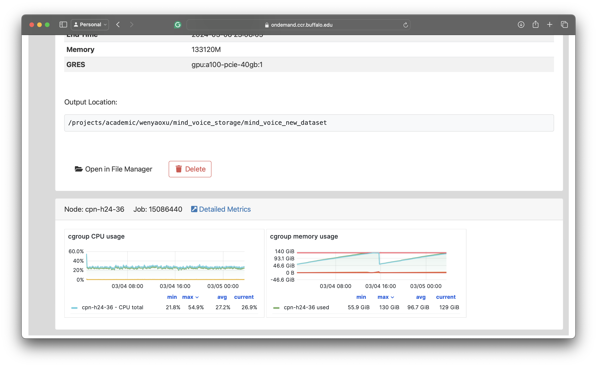

# ESC Group CCR Handbook (In Progress)
*If you want to contributing to the handbook please start a pull request*

---
***Adopted from https://docs.ccr.buffalo.edu/en/latest/***


In this handbook, I will provide an overview of the resources in CCR and how to make a quick start. Then, I will structure an outline Q&A section and list the common questions and troubleshooting solutions.

## What is CCR?
“The Center for Computational Research (CCR) at the University at Buffalo is a high-performance research computing center offering faculty, staff, students, and local businesses access to supercomputing environments, high-end visualization services, an on-premise research cloud infrastructure, and experienced staff to help you move your research forward.” (source: https://docs.ccr.buffalo.edu/en/latest/) 

*TLDR: CCR is a high-performance research computing center at the University at Buffalo. We will use the computing nodes CCR offers to run our programs, and the project storage to store data and collaborate on projects.*

## What resources does CCR offer?
 
CCR offers a variety of resources, but only HPC Clusters and Project Storage are important to us. *(Rest can be found at https://docs.ccr.buffalo.edu/en/latest/available-resources/)*

### HPC Clusters

HPC stands for High Performance Computing and UB CCR provides bulk access to high performance CPUs and GPUs.

HPC has several partitions, each of which offer certain kinds of nodes (actual hardware), out of which the most important ones are:

- **debug**: for debugging; virtually no queue wait time; max 1 hour job time limit. Debug partition contains debug nodes.

- **general-compute**: Main partition; We'll use this most of the time; queue wait time depends on the resources requested and current CCR allocations; jobs are run for the entire duration requested. general-compute partition contains compute nodes on which we'll run our jobs (programs).

- **scavenger**: Scavenge idle GPUs; your job would be cancelled as soon as the GPU owner starts his or her job; quick access to powerful GPUs if your job can be regularly checkpointed (I use this with Weights & Biases Logging). scavenger partition contains compute nodes on which we'll run our jobs (programs).

[More Details on Currently Available Hardware](Nodes.md)

### Project Storage

CCR provides storage for faculty groups. All members of the group have access to it. We currently have 1TB group storage at `/projects/academic/wenyaoxu/`. 

Additinaly, CCR provides 10GB personal storage to each user, located at `/user/<username>/`.

If you need more storage please contact Wenyao.

## QuickStart

For a brief overview for CCR you may watch https://www.youtube.com/watch?v=ryBqdeqTO4o. I would not cover the topics already covered in the video.

1. Create an CCR account at https://idm.ccr.buffalo.edu/signup
2. Share your CCR account with faculty so that your account can be granted access.
3. Set up SSH keys by following the guide at https://docs.ccr.buffalo.edu/en/latest/hpc/login/
4. Open a Terminal on your local machine and ssh into the login/frontend node (default) 
    ``` 
    ssh <username>@vortex.ccr.buffalo.edu -o "ServerAliveInterval 60"
    ```

    `-o "ServerAliveInterval 60"` flag is optional, but recommended, and meant to stop the ssh connection from timing out.

    it should look something like this: 

    **IMPORTANT!** Do NOT run heavy computation on the login/frontend nodes. They are meant for editing scripts, moving files, small data transfers, submitting jobs.

    

5. CCR uses *Slurm* job scheduler. You have two options to access the compute nodes. 
    1. **Batch Jobs**: Write a *Slurm* script file detailing the hardware configuration, software modules to load, and how and what programs to run. It it fully automated and you don't have direct ssh access to the compute nodes. Once the job is running you can't change anything. [Details Here](Batch-Jobs.md)
    2. **Interactive Jobs**: Request a specific hardware and then access it directly from terminal. Useful for faster iteration, and when you are not sure what the specific steps are. [Details Here](Interactive-Jobs.md)


## OnDemand Portal
"Open OnDemand is a browser based single point of access for all of CCR's clusters, shared storage, and remote visualization servers. OnDemand provides a graphical interface to view, edit, download, and upload files, manage and create job templates for CCR's clusters, and access interactive applications such as remote desktops to cluster nodes and the visualization servers, as well as GUI-based software like Matlab, Jupyter Lab/Notebook, and vscode. All of this is done through the browser on almost any device, requires no additional software to be installed, and with minimal knowledge of Linux and job scheduler commands." (CCR website, 2024)

*TLDR: It a website that provide a GUI for some of CCR's features. Useful if you prefer a GUI over the command line, although not all functionality of the command line is included and most of the included ones don't work properly. One the main advantages, what I use it for, is the you can monitor the harware resource utilization (similar to task manager in windows)*

***PS: I  would not recommend starting any sort of Job or requesting resources using OnDemand as I've ran into multiple issues and using the command line is much easier.***

OnDemand can be accessed at https://ondemand.ccr.buffalo.edu/

Fig: Screenshots of the Job Page of the OnDemand Portal.



## File Transfer

If you need to transfer files to and from CCR, there are two options.

1. Small Files: Use 

